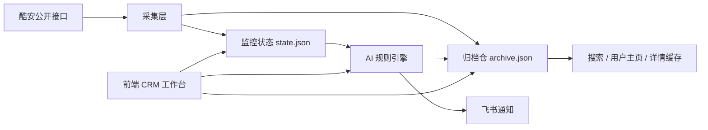

# 话题雷达架构

## 设计目标

服务将“实时监控”和“长期检索”分开：前者保持轮询轻量、响应迅速；后者保存足够的帖子、判断和用户公开资料，供 AI 命中回看、搜索和用户主页使用。所有写入由单一持久化队列串行执行，并通过临时文件加原子重命名提交，避免并发写入造成文件内容交错。

## 数据分层

| 存储 | 责任 | 内容 |
| --- | --- | --- |
| `data/state.json` | 热数据与监控配置 | 被监控话题、每话题当前动态、抓取配置、轮询状态 |
| `data/settings.json` | 服务设置 | AI、飞书、去重 ID、数据保留策略；读取接口只返回密钥掩码和配置状态 |
| `data/archive.json` | 长期数据 | 去重后的帖子、详情和首页评论、AI 判断、用户公开资料、系统活动 |

`archive.json` 为按帖子 ID 索引的归档仓。同一帖子在多个话题、搜索或详情页中再次出现时会合并来源和更新时间，避免重复保存。详情请求成功时保存完整动态和第一页评论；网络波动期间可优先展示已归档的详情。

## 采集与排序

- 采集固定按发布时间增量翻页，直到碰到上次成功批次中的帖子；达到单轮上限或中途页失败时会归档已拿到的数据、保留原游标并持久化续抓页。下一轮先用前沿锚点计算新增分页位移，再从调整后的位置重叠一页续抓，完整闭合后才推进成功游标。第一页失败或返回异常空数据时保留上次成功快照。
- 每个话题可保留 10–100 条当前热数据；工作台统一查询归档仓，支持 20/50/100 条分页，因此热数据数量不再限制历史回看。
- 工作台表格支持创建时间正序/倒序、最后更新时间、互动热度和 AI 匹配度排序；它只影响展示，不改变归档原始数据。
- 帖子搜索依次结合远端搜索候选、已监控话题、归档和全站动态源，结果进入归档后可持续回溯。
- 全站探索页提供新鲜动态、热门动态、帖子搜索和用户公开资料入口，详情和用户主页均在当前应用内打开。

## AI 接口兼容层

AI 适配层按协议生成请求、请求头和图片内容块，并把不同供应商的结果统一为 `matchScore`、`reason`、`evidence`。`matchScore` 只表示内容符合关注意图的程度，服务端使用当前话题的有效阈值派生最终命中，避免把“对未命中结论的把握度”误显示成匹配概率。

| 供应商 / 网关 | 协议模式 | 端点形态 |
| --- | --- | --- |
| OpenAI 及兼容服务 | `responses` / `chat_completions` | `/responses` 或 `/chat/completions` |
| Anthropic | `anthropic_messages` | `/messages` |
| Gemini | `gemini_generate_content` | `/models/{model}:generateContent` |

自动模式会依据供应商和 Base URL 选择优先协议，并在兼容网关返回协议差异时按候选协议降级重试。结构化 JSON、视觉输入和错误信息也经过归一化；视觉输入不被服务端接纳时，本轮会保留帖子文字判断并记录兼容性信息。

话题阈值为空时继承全局阈值。AI 请求异常的帖子不会进入完成集合，而是记录重试次数和下一次重试时间；页面将异常显示为“等待重试”，不再显示误导性的 0%。AI 统计按 `topic + feedId` 选取最新判断后聚合，手动复核产生的历史记录不会重复计入当前指标。

## 保留与维护

默认策略：帖子 180 天、AI 判断 365 天、用户公开资料 45 天、活动 180 天；并保留最多 30,000 条帖子、15,000 条判断、5,000 条活动。后台轮询会根据清理间隔自动维护，设置页的“立即清理”会以当前设置执行相同逻辑。清理优先按时间窗移除过期记录，再按最新时间裁剪至容量上限。

## 扩展边界

- 新的酷安数据源只需在采集层返回标准帖子或用户摘要，即可自动接入归档、搜索和展示层。
- 归档文件可平滑迁移至 SQLite/PostgreSQL：以 `feeds.id`、`users.uid`、`evaluations.id` 为主键，保留现有 API 契约。
- 定时任务目前由应用进程负责；多实例部署时可迁移到单独的 worker 或调度器，避免多节点重复抓取。
